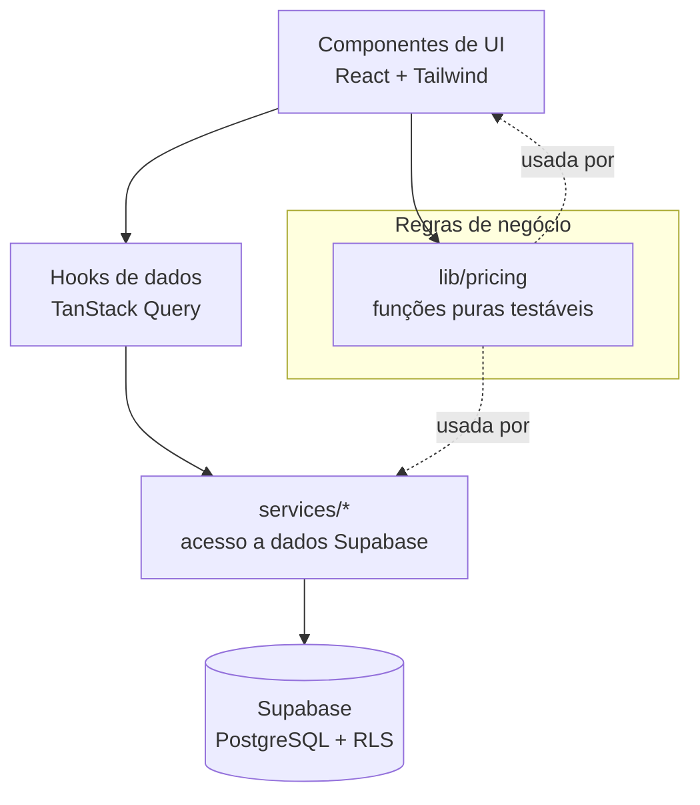

# Arquitetura — FSP (Formação de Preços & Gestão)

> Plataforma SaaS multi-tenant de formação de preços, orçamento, custos, estoque e gestão
> financeira para prestadores de serviços (tatuadores, fotógrafos, mecânicos, etc.).

## 1. Visão geral

O sistema responde a uma pergunta central: **"Quanto eu preciso cobrar por este serviço
para cobrir meus custos, remunerar minha mão de obra e atingir o lucro desejado?"**

Cadeia conceitual do produto:

```
Formação de preço  →  Serviço  →  Orçamento  →  Cliente
```

- **Formação de preço**: construção do preço ideal de um serviço (custo, mínimo, recomendado, premium).
- **Orçamento**: uso de um preço já formado para gerar uma proposta a um cliente específico.

## 2. Stack

| Camada            | Tecnologia                                   |
|-------------------|----------------------------------------------|
| Banco / Backend   | Supabase (PostgreSQL, Auth, RLS, Storage, RPC) |
| Frontend          | React 18 + TypeScript + Vite                 |
| Estilo            | Tailwind CSS (tokens de design semânticos)   |
| Estado/Queries    | TanStack Query + Context                      |
| Roteamento        | React Router                                  |
| Gráficos          | Recharts                                       |
| Validação         | Zod (frontend) + CHECK constraints (banco)   |
| Testes            | Vitest + Testing Library                       |
| Qualidade         | ESLint + Prettier                             |
| Deploy            | Vercel / Netlify / Cloudflare Pages (build estático) |

## 3. Camadas do frontend



**Princípio-chave:** toda regra financeira vive em `src/lib/pricing/` como funções puras
(sem dependência de UI ou de rede), 100% cobertas por testes unitários. Componentes e serviços
apenas orquestram entrada/saída dessas funções.

## 4. Estrutura de pastas

```
fsp-precos/
├── docs/                     # Documentação de arquitetura e decisões
├── supabase/
│   ├── migrations/           # DDL versionado (SQL)
│   └── seed/                 # Dados demonstrativos
├── src/
│   ├── app/                  # Bootstrap, providers, router
│   ├── layouts/              # MobileLayout (bottom nav), DesktopLayout (sidebar)
│   ├── components/           # Componentes de UI reutilizáveis
│   ├── features/             # Módulos por domínio
│   │   ├── auth/
│   │   ├── organization/
│   │   ├── professionals/
│   │   ├── labor/
│   │   ├── products/
│   │   ├── inventory/
│   │   ├── costs/
│   │   ├── pricing/          # UI da formação de preço
│   │   ├── quotes/
│   │   ├── customers/
│   │   ├── cashflow/
│   │   ├── dashboard/
│   │   └── goals/
│   ├── lib/
│   │   ├── pricing/          # ⭐ Lógica financeira PURA + testes
│   │   ├── money/            # Formatação BRL (pt-BR), numeric helpers
│   │   ├── supabase/         # Cliente e tipos gerados
│   │   └── validation/       # Schemas Zod
│   ├── hooks/                # Hooks de dados (TanStack Query)
│   ├── services/             # Acesso a dados (queries/mutations Supabase)
│   └── types/                # Tipos de domínio
├── .env.example
├── CLAUDE.md
└── README.md
```

## 5. Multi-tenancy e segurança

- Toda tabela de dados carrega `organization_id`.
- **RLS obrigatório** em todas as tabelas; nenhuma autorização depende apenas do frontend.
- Associação usuário↔organização via `memberships` (role por membro).
- Detalhes em [RLS.md](RLS.md).

## 6. Responsividade

Dois layouts distintos selecionados por largura de tela:
- **MobileLayout**: bottom navigation, botões grandes, formulários multi-step, FAB.
- **DesktopLayout**: sidebar, tabelas densas, filtros, dashboards completos.

Arquitetura preparada para evoluir para **PWA / app nativo** (componentes desacoplados de layout).

## 7. Roadmap de evolução (pós-MVP)

PWA · notificações · IA · integração WhatsApp · geração de PDF (@react-pdf/renderer) ·
pagamentos/assinatura · relatórios avançados · métodos de custeio PEPS/último preço ·
múltiplas unidades.
