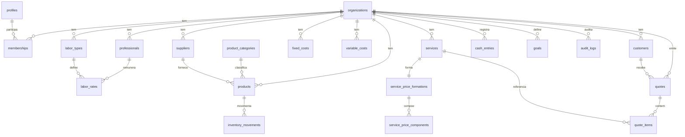

# Modelo de Dados — FSP

DDL versionado em [`supabase/migrations/`](../supabase/migrations/):
`0001_init.sql` (schema), `0002_rls.sql` (RLS), `0003_functions.sql` (RPCs).

## Convenções
- Toda tabela de dados tem `organization_id` (isolamento multi-tenant).
- Monetário: `numeric(14,4)`. Datas/horas: `timestamptz`. IDs: `uuid` (`gen_random_uuid()`).
- `CHECK` constraints garantem valores ≥ 0, ordenação de margens, coerência de enums.
- `updated_at` mantido por trigger `set_updated_at()`.

## Diagrama entidade-relacionamento

## Grupos de tabelas

| Grupo | Tabelas |
|-------|---------|
| Tenancy & acesso | `organizations`, `profiles`, `memberships`, `module_permissions`, `professions` (global) |
| Profissionais & mão de obra | `professionals`, `labor_types`, `labor_rates` |
| Produtos & estoque | `suppliers`, `product_categories`, `products`, `inventory_movements` |
| Custos | `fixed_costs`, `variable_costs` |
| Clientes & serviços | `customers`, `services`, `service_price_formations`, `service_price_components` |
| Orçamentos | `quotes`, `quote_items` |
| Financeiro & metas | `cash_entries`, `goals` |
| Sistema | `settings`, `audit_logs` |

## Decisões de modelagem
- **Estoque derivável do histórico**: `inventory_movements` é o log; `products.stock_current`
  e `avg_cost` são mantidos sincronizados **exclusivamente** pela RPC
  `register_inventory_movement()` (fonte única da verdade). Testes validam a consistência.
- **Formação de preço com snapshot**: `service_price_formations` guarda os parâmetros
  (margens, imposto, comissão, custo fixo/hora) e os resultados no momento do cálculo,
  garantindo rastreabilidade mesmo que a configuração da org mude depois.
- **Modelos de remuneração extensíveis**: enum `labor_model`; novos modelos futuros
  podem ser adicionados sem quebrar o schema (colunas de valor são nullable por modelo).
- **audit_logs append-only**: escrita só via `audit_log()` (SECURITY DEFINER); sem
  políticas de INSERT/UPDATE/DELETE diretas.
