# Mapa de Telas e Fluxo de Navegação — FSP

## Fluxo principal (critério de sucesso do MVP)

```mermaid
flowchart LR
    A[Criar conta] --> B[Criar empresa/estúdio]
    B --> C[Escolher profissão]
    C --> D[Cadastrar profissionais]
    D --> E[Custos fixos]
    E --> F[Custos variáveis]
    F --> G[Produtos]
    G --> H[Entrada de estoque]
    H --> I[Mão de obra]
    I --> J[Cadastrar serviço]
    J --> K[Formação de preço]
    K --> L[Preço mínimo & recomendado]
    L --> M[Cadastrar cliente]
    M --> N[Criar orçamento]
    N --> O[Registrar venda/entrada]
    O --> P[Baixa de materiais]
    P --> Q[Atualiza estoque]
    Q --> R[Atualiza fluxo de caixa]
    R --> S[Atualiza dashboard]
    S --> T[Ver quanto sobrou]
```

## Áreas / rotas

| Rota | Tela | Notas |
|------|------|-------|
| `/login`, `/signup`, `/recover` | Autenticação | Supabase Auth |
| `/onboarding` | Criar organização + escolher profissão | multi-step |
| `/` | **Dashboard** executivo | KPIs, gráficos, alertas, estoque crítico |
| `/professionals` | Profissionais | lista + form |
| `/labor` | Mão de obra (tipos + remuneração) | modelos configuráveis |
| `/products` | Produtos/Materiais | catálogo, estoque mín/máx |
| `/inventory` | Estoque | entradas, saídas, ajustes, histórico |
| `/costs/fixed` | Custos fixos | periodicidade → base mensal |
| `/costs/variable` | Custos variáveis | |
| `/customers` | Clientes | histórico de orçamentos |
| `/services` | Serviços | base da formação de preço |
| `/pricing/:serviceId` | **Formação de preço** | componentes + breakdown (custo/mín/rec/premium) |
| `/goals` | Minha Meta | simulador what-if |
| `/quotes` | Orçamentos | lista |
| `/quotes/:id` | Orçamento (view profissional, print-ready) | @media print |
| `/cashflow` | Fluxo de caixa | entradas/saídas, períodos |
| `/settings` | Configurações da empresa | moeda, impostos, produtividade, margens |

## Layouts
- **DesktopLayout**: sidebar fixa + topbar; tabelas densas; filtros; dashboard completo.
- **MobileLayout**: bottom navigation (Dashboard, Preços, Orçamentos, Estoque, Mais);
  formulários multi-step; cards; FAB para ações rápidas.
- Seleção por breakpoint Tailwind (`lg`). Componentes de conteúdo compartilhados entre layouts.

## Composição do preço (tela central)
Painel com breakdown visual mostrando, para cada preço:
`custo · comissão · impostos · lucro` — com explicação textual da fórmula (rastreabilidade,
ver [PRICING_RULES.md](PRICING_RULES.md) §6–7). Dourado destaca lucro/valores premium;
vermelho para "abaixo do preço mínimo".
